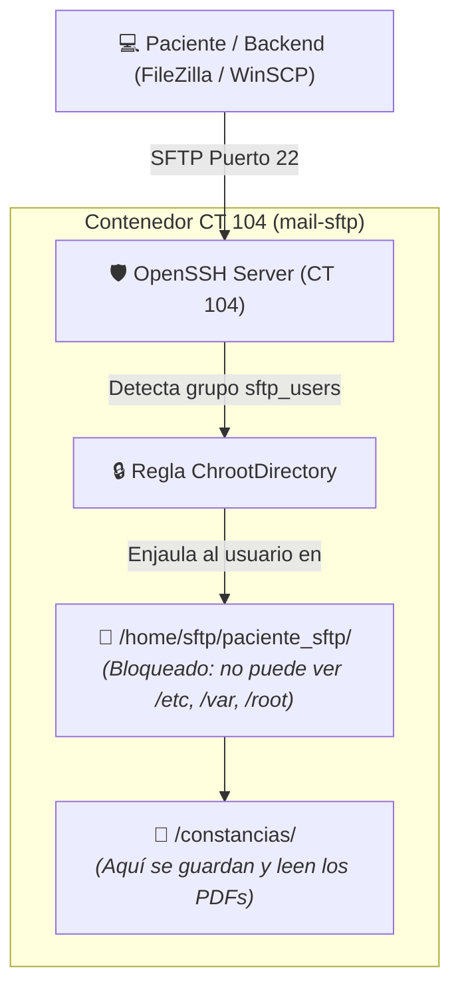

# 📁 Guía Práctica de Aprendizaje: Instalación y Configuración de Servidor SFTP enjaulado (Chroot Jail) en CT 104

> **Proyecto:** Sistema Clínico Grupo 2 — Sistemas Operativos I (UMG)  
> **Servidor Destino:** `CT 104` (`mail-sftp`) — IP: `192.168.56.104`  
> **Subdominio Autoritativo:** `sftp.grupo2.os` (Puerto `22`)  
> **Dirigido a:** Integrante encargado del módulo de servicios auxiliares y almacenamiento  
> **Nivel Requerido:** Principiante (Todo está explicado con comandos exactos de copiar y pegar)  
> **Tiempo Estimado:** 20 a 25 minutos  

---

## 🎯 1. ¿Qué vamos a aprender y construir en esta práctica?

Actualmente en **CT 104** ya tenemos configurados los servicios de correo (**Postfix SMTP** en el puerto `25` y **Dovecot IMAP** en el puerto `143`).

Ahora configuraremos el servicio de **Almacenamiento Seguro (SFTP)** utilizando el servidor **OpenSSH** que ya viene instalado en Debian 12.

### 🔒 ¿Qué es una Jaula SFTP (*Chroot Jail*)?
En los sistemas operativos tipo Unix, un *Chroot* (Change Root) cambia el directorio raíz aparente para un usuario. 
* El usuario `paciente_sftp` se conectará por SFTP para descargar sus constancias médicas y recetas.
* **Seguridad Estricta:** El usuario estará "enjaulado". Si intenta subir directorios (`cd ../../`), el sistema no lo dejará salir de su carpeta asignada.
* **Sin Acceso a Terminal:** Tendrá denegado el acceso a la consola de Linux (`/usr/sbin/nologin`). Si intenta entrar por SSH tradicional a ver archivos confidenciales del sistema operativo, el servidor lo expulsará de inmediato.



---

## 🔑 2. Credenciales y Datos que Necesitas Conocer

* **Servidor de Almacenamiento (CT 104):** `192.168.56.104` (o `sftp.grupo2.os`)
* **Puerto de conexión:** `22` (SFTP estándar)
* **Usuario que crearemos:** `paciente_sftp`
* **Contraseña del usuario:** `proxmox`
* **Grupo de seguridad:** `sftp_users`
* **Contraseña de root para configurar:** `proxmox`

---

## 🛠️ 3. Paso a Paso Manual (Configuración en CT 104)

Sigue cada uno de estos pasos directamente en la consola para completar la instalación.

---

### Paso 1: Conectarte por SSH a CT 104
Abre **PowerShell** o **Terminal** en tu computadora con Windows y conéctate como administrador a CT 104:

```powershell
ssh root@192.168.56.104
```
*(Contraseña: `proxmox`)*

Verás que el indicador cambia a: `root@mail-sftp:~#`

---

### Paso 2: Crear el grupo de seguridad para usuarios SFTP
Para no mezclar usuarios comunes con usuarios restringidos, crearemos un grupo exclusivo llamado `sftp_users`:

```bash
groupadd sftp_users
```

---

### Paso 3: Crear el usuario `paciente_sftp` sin acceso a consola
Crearemos el usuario asignándole el grupo `sftp_users`, una carpeta de inicio especial y bloqueando su acceso a la terminal con `/usr/sbin/nologin`:

```bash
useradd -g sftp_users -d /home/sftp/paciente_sftp -s /usr/sbin/nologin paciente_sftp
```

Asígnales la contraseña estándar `proxmox`:
```bash
echo "paciente_sftp:proxmox" | chpasswd
```

---

### Paso 4: Crear las carpetas con los permisos de la Jaula (*¡Paso Crítico!*)

> [!IMPORTANT]
> **Regla de Oro de OpenSSH Chroot:**
> La carpeta raíz de la jaula (`/home/sftp/paciente_sftp`) **DEBE ser propiedad exclusiva de `root:root`** y tener permisos `755`. Si el usuario común es dueño de su carpeta raíz, OpenSSH abortará la conexión por seguridad.  
> Por eso, crearemos una subcarpeta llamada `constancias/` adentro, la cual sí le pertenecerá al usuario para que pueda subir y descargar archivos.

Ejecuta exactamente estos comandos en orden:

```bash
# 1. Crear las carpetas de la jaula y del buzón de constancias
mkdir -p /home/sftp/paciente_sftp/constancias

# 2. Asignar propiedad de root a la raíz de la jaula
chown root:root /home/sftp
chown root:root /home/sftp/paciente_sftp
chmod 755 /home/sftp
chmod 755 /home/sftp/paciente_sftp

# 3. Dar permisos al usuario sobre la subcarpeta 'constancias'
chown -R paciente_sftp:sftp_users /home/sftp/paciente_sftp/constancias
chmod 755 /home/sftp/paciente_sftp/constancias
```

Verifica cómo quedaron los permisos con:
```bash
ls -ld /home/sftp/paciente_sftp
ls -ld /home/sftp/paciente_sftp/constancias
```
*(El primero debe decir `root root`, y el segundo `paciente_sftp sftp_users`).*

---

### Paso 5: Configurar la Jaula en OpenSSH
En lugar de modificar el archivo principal de SSH, crearemos un archivo limpio y modular en `/etc/ssh/sshd_config.d/sftp.conf`.

Abre el archivo con `nano`:
```bash
nano /etc/ssh/sshd_config.d/sftp.conf
```

Copia y pega exactamente este bloque de configuración:

```text
# Configuración de Jaula SFTP Aislada para Grupo 2
Match Group sftp_users
    ChrootDirectory /home/sftp/%u
    ForceCommand internal-sftp
    X11Forwarding no
    AllowTcpForwarding no
    PasswordAuthentication yes
```

> 📘 **¿Qué hace cada directiva?:**
> * `Match Group sftp_users`: Solo aplica estas reglas a los miembros de este grupo.
> * `ChrootDirectory /home/sftp/%u`: Encierra al usuario en su carpeta (`%u` se reemplaza por el nombre de usuario).
> * `ForceCommand internal-sftp`: Obliga al usuario a usar el protocolo de transferencia SFTP e ignora cualquier intento de abrir consola interactiva.
> * `X11Forwarding no` y `AllowTcpForwarding no`: Cierra cualquier posibilidad de hacer túneles de red.

Guarda los cambios (`Ctrl + O`, luego `Enter`) y sal (`Ctrl + X`).

---

### Paso 6: Validar la sintaxis y reiniciar el servicio SSH
Antes de reiniciar el servidor SSH, verifica que no haya ningún error tipográfico:

```bash
sshd -t
```
*(Si no muestra ningún mensaje en pantalla, significa que la sintaxis es **perfecta**).*

Ahora reinicia el servicio SSH para que tome los cambios:
```bash
systemctl restart ssh
systemctl is-active ssh
```
*(Debe responder **`active`**).*

---

## 🧪 4. Pruebas de Funcionamiento (Independientes del resto del proyecto)

Puedes probar al 100% que tu servidor SFTP funciona de forma aislada desde tu computadora con Windows, sin necesidad de que la aplicación web esté terminada.

---

### Prueba 1: Verificar el bloqueo de seguridad (La prueba del hacker)
Debemos demostrarle al profesor que el usuario **no puede entrar a la consola**.

Abre una **nueva ventana de PowerShell en Windows** (sin cerrar la otra) e intenta conectarte como `paciente_sftp`:

```powershell
ssh paciente_sftp@192.168.56.104
```
* Te pedirá contraseña: escribe `proxmox` y presiona Enter.
* **Resultado esperado:**
  ```text
  This service allows sftp connections only.
  Connection to 192.168.56.104 closed.
  ```
¡El servidor lo expulsó de inmediato! Esto demuestra que la seguridad está activa y funcionando.

---

### Prueba 2: Probar la transferencia SFTP por consola
Desde la misma ventana de PowerShell en Windows, conéctate usando el comando `sftp`:

```powershell
sftp paciente_sftp@192.168.56.104
```
*(Contraseña: `proxmox`)*

Verás que entras al modo interactivo:
```text
Connected to 192.168.56.104.
sftp>
```

1. Pregunta en qué carpeta estás:
   ```text
   sftp> pwd
   Remote working directory: /
   ```
   *(Fíjate que dice `/`. El usuario cree que está en la raíz de la máquina, pero en realidad está encerrado en su jaula).*
2. Lista las carpetas disponibles:
   ```text
   sftp> ls
   constancias
   ```
3. Entra a la carpeta de constancias:
   ```text
   sftp> cd constancias
   sftp> pwd
   Remote working directory: /constancias
   ```
4. Sal de la sesión:
   ```text
   sftp> exit
   ```

---

### Prueba 3: Conectar mediante un cliente gráfico en Windows (FileZilla o WinSCP)

Esta es la prueba más visual y la mejor para mostrar al catedrático en la presentación:

1. Abre **FileZilla** o **WinSCP** en Windows.
2. Ingresa los siguientes datos de conexión en la barra superior o en nueva conexión:

| Campo | Valor a Configurar |
| :--- | :--- |
| **Protocolo:** | **SFTP - SSH File Transfer Protocol** |
| **Servidor / Host:** | `192.168.56.104` *(o `sftp.grupo2.os`)* |
| **Puerto:** | `22` |
| **Usuario:** | `paciente_sftp` |
| **Contraseña:** | `proxmox` |

3. Haz clic en **Conexión rápida** o **Conectar**.
4. Acepta la clave del servidor si te muestra una advertencia de primera conexión.
5. Verás inmediatamente la carpeta **`constancias`**.
*(Nota: En esta etapa de pruebas iniciales, la subida está habilitada para que puedas comprobar que el servidor y las carpetas funcionan al 100%. Una vez concluidas las pruebas, procede a la Fase 5 a continuación para blindar el servidor con solo lectura y habilitar la cuenta de servicio del backend).*

---

## 🔒 5. Fase de Producción y Blindaje: Restricción de Subidas (`-R`) y Usuario del Backend

> [!IMPORTANT]
> **Tareas Pendientes para Paso a Producción:**
> 1. Activar la bandera **`-R`** (*Read-Only*) para los pacientes.
> 2. Crear la cuenta de servicio **`backend_sftp`** para que la aplicación Next.js sea la única autorizada a depositar archivos.
>
> En un sistema clínico real, los pacientes **nunca deben tener permisos para subir archivos arbitrarios** (evitando inyección de malware, sobreescritura de recetas o saturación del almacenamiento). Los pacientes únicamente deben poder **descargar** sus documentos.

Sigue estos pasos una vez que hayas finalizado las pruebas de la Fase 4:

---

### Paso 5.1: Crear el usuario de servicio del Backend (`backend_sftp`)
Crearemos un usuario exclusivo para la aplicación Next.js, configurando su directorio base en `/home/sftp` y asegurando permisos de grupo para que pueda escribir en las carpetas de los pacientes:

```bash
# 1. Crear el usuario de servicio
useradd -g sftp_users -d /home/sftp -s /usr/sbin/nologin backend_sftp

# 2. Asignar contraseña estándar
echo "backend_sftp:proxmox" | chpasswd

# 3. Otorgar permisos de grupo para que el backend pueda escribir en las constancias
chmod 775 /home/sftp/paciente_sftp/constancias
```

---

### Paso 5.2: Configurar la regla de Solo Lectura (`-R`) y Acceso del Backend en OpenSSH
Edita el archivo de configuración modular de SFTP:

```bash
nano /etc/ssh/sshd_config.d/sftp.conf
```

Reemplaza todo el contenido con la siguiente configuración jerárquica:

```text
# 1. Regla para el Backend (Acceso con permisos de depósito y subida)
Match User backend_sftp
    ChrootDirectory /home/sftp
    ForceCommand internal-sftp
    X11Forwarding no
    AllowTcpForwarding no
    PasswordAuthentication yes

# 2. Regla para Pacientes (Solo Lectura Estricta con bandera -R)
Match Group sftp_users
    ChrootDirectory /home/sftp/%u
    ForceCommand internal-sftp -R
    X11Forwarding no
    AllowTcpForwarding no
    PasswordAuthentication yes
```

> 📘 **Explicación de la Seguridad:**
> * OpenSSH lee las reglas en orden: como `backend_sftp` coincide primero por `Match User`, se le aplica `internal-sftp` estándar (lectura y escritura).
> * Los usuarios regulares de `sftp_users` (como `paciente_sftp`) caen en la segunda regla, donde la bandera **`-R`** bloquea de forma inmediata cualquier operación de escritura (`put`, `mkdir`, `rm`, etc.).

Guarda los cambios (`Ctrl + O`, luego `Enter`) y sal (`Ctrl + X`).

---

### Paso 5.3: Validar y reiniciar el servicio SSH
```bash
sshd -t
systemctl restart ssh
systemctl is-active ssh
```
*(Debe responder `active`).*

---

### Paso 5.4: Pruebas de Verificación del Blindaje

1. **Prueba de Rechazo al Paciente (Validar que el bloqueo funciona):**
   * Conéctate por PowerShell o FileZilla con el usuario `paciente_sftp` (contraseña `proxmox`).
   * Intenta subir un archivo arrastrándolo a la carpeta `constancias`.
   * **Resultado esperado:** El servidor responde **`Permission denied`** o **`Error al subir archivo`**. La subida queda totalmente bloqueada.
   * Sin embargo, el paciente **sí puede listar y descargar** cualquier archivo que ya exista.

2. **Prueba de Depósito desde el Backend:**
   * Conéctate en FileZilla o PowerShell con el usuario `backend_sftp` (contraseña `proxmox`).
   * Entra a la carpeta `/paciente_sftp/constancias`.
   * Sube un archivo de prueba.
   * **Resultado esperado:** La subida se completa al 100% con éxito.

---

## 🔄 6. ¿Qué hace falta para integrarlo con la aplicación web de la clínica?

Una vez que la aplicación web en **CT 102** esté activa y el blindaje configurado, la integración entre la web y el SFTP se realiza mediante código en el backend. 

1. **Generación automática del PDF en la Web:**
   * En la aplicación Next.js, cuando un médico finaliza una consulta, un endpoint en `/api/constancias` compila el archivo `constancia_medica_123.pdf`.
2. **Subida por SFTP desde Node.js usando la cuenta de servicio (`CT 102` $\rightarrow$ `CT 104`):**
   * El backend usará la librería estándar de Node `ssh2-sftp-client` con las credenciales de `backend_sftp`:
     ```typescript
     import Client from "ssh2-sftp-client";
     const sftp = new Client();

     await sftp.connect({
       host: "192.168.56.104", // o "sftp.grupo2.os"
       port: 22,
       username: "backend_sftp",
       password: "proxmox"
     });

     // Sube la constancia directamente a la carpeta del paciente
     await sftp.put(bufferPDF, "/paciente_sftp/constancias/constancia_123.pdf");
     await sftp.end();
     ```
3. **Notificación por Correo (Cierre del circuito):**
   * Justo después de que el PDF se deposita en el SFTP, la aplicación envía un correo con `nodemailer` a través de Postfix (en el mismo `CT 104`) avisándole al paciente:
     > *"Estimado paciente, su constancia médica ha sido emitida con éxito. Puede descargarla desde sftp.grupo2.os con su usuario paciente_sftp"*.

---

## ❓ 6. Solución de Problemas Frecuentes (*Troubleshooting*)

* **Error: `fatal: bad ownership or modes for chroot directory`:**
  * Este es el error más común en Linux cuando se configura una jaula. Ocurre si la carpeta `/home/sftp/paciente_sftp` no le pertenece a root.
  * **Solución:** Ejecuta en CT 104:
    ```bash
    chown root:root /home/sftp /home/sftp/paciente_sftp
    chmod 755 /home/sftp /home/sftp/paciente_sftp
    ```
* **Error: `Permission denied` al subir un archivo:**
  * Ocurre si el usuario intenta subir archivos directamente a `/` en vez de a `/constancias`.
  * La raíz de la jaula es de solo lectura para evitar que el usuario altere su propia jaula. Todos los archivos deben subirse dentro de `/constancias/`.
* **No conecta por el nombre `sftp.grupo2.os`:**
  * Asegúrate de que tu DNS esté apuntando a CT 101 (`192.168.56.101`) o haz la prueba directamente con la IP `192.168.56.104`.
