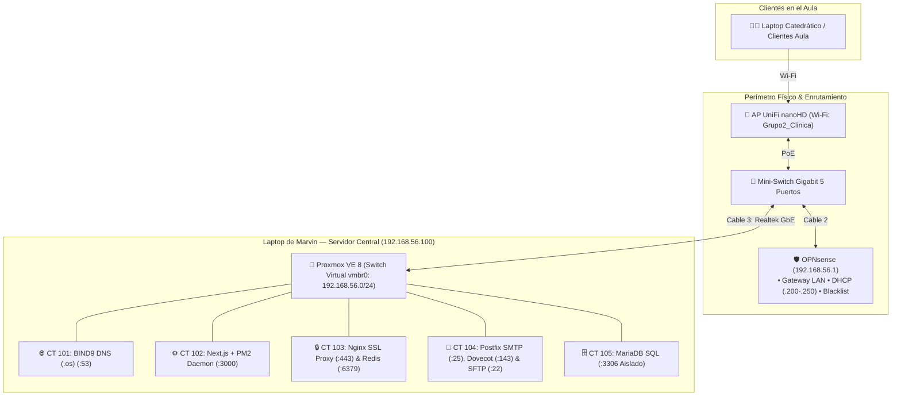

# 📋 Guía Operativa de Presentación — Líder de Proyecto (Marvin)

> **Universidad Mariano Gálvez de Guatemala (UMG)**  
> **Facultad de Ingeniería en Sistemas de Información y Ciencias de la Computación**  
> **Curso:** Sistemas Operativos I (Sección B)  
> **Proyecto Final:** Sistema Integral de Gestión Clínica y Expedientes Médicos Seguros  
> **Grupo Asignado:** **Grupo 2** (`grupo2.os`)  
> **Rol Principal:** Líder del Proyecto, Administrador de Infraestructura Proxmox VE 8 & DevSecOps  
> **Duración Estimada:** ~4.5 minutos en total (Apertura: ~1.5 - 2 min | Cierre Técnico: ~2.5 - 3 min)  
> **Puntos Extra que Defiendes:** Base de Datos Híbrida (SQL + NoSQL), Monorepo Git Centralizado, Aislamiento Estricto de BD por Firewall y Restricción Egress WAN.

---

## 🏗️ 1. Breve Explicación de la Arquitectura General

Como líder del proyecto, tu misión es transmitir al catedrático la visión holística del ecosistema y la justificación de diseño a nivel de Sistemas Operativos:



* **Virtualización Ligera sobre el Kernel:** El sistema corre sobre **Proxmox VE 8** (Debian 12) desplegando **5 Contenedores Linux (LXC)**. A diferencia de las máquinas virtuales completas (KVM) que duplican kernels y emulan hardware, LXC comparte el kernel del host mediante dos primitivas nativas de Linux:
  * **Namespaces (Aislamiento — "¿Qué puedo ver?"):** Aísla procesos (PID), interfaces de red virtuales e IPs (NET), tablas de montaje (MNT), nombres de host (UTS) y comunicación interprocesos (IPC). Cada contenedor cree que es el único dueño del sistema operativo.
  * **cgroups (Límites de recursos — "¿Cuánto puedo gastar?"):** Establece cuotas y topes estrictos de memoria RAM y núcleos de CPU para evitar que un contenedor monopolice los recursos de la máquina física.
  * **Beneficio Clave:** Rendimiento nativo de CPU/memoria, arranque instantáneo (1 a 3 segundos) y consumo global ultra-bajo (< 2.5 GB RAM para 5 servidores empresariales completos).
* **Red Virtual Interna:** Todos los contenedores se interconectan mediante el switch virtual **`vmbr0`** en la subred privada `192.168.56.0/24`.
* **Desacoplamiento Estricto:** Cada contenedor asume una única responsabilidad en la arquitectura (CT 101 Red/DNS, CT 102 Backend, CT 103 Proxy/Redis, CT 104 Mail/SFTP, CT 105 Base de Datos), evitando puntos únicos de fallo.
* **Seguridad Perimetral & DevSecOps:** Integración física con OPNsense (router/DHCP/Blacklist), aislamiento perimetral de puertos con `iptables` y bloqueo de fuga de paquetes hacia Internet (*Egress Filtering*).

---

## 🖥️ 2. Pantallas que Debes Tener Listas Antes de Llamar al Catedrático

En tu laptop de presentación, mantén abiertas y maximizadas estas ventanas:

1. **Ventana 1 (Navegador):** Interfaz Web de Proxmox VE en `https://192.168.56.100:8006` con el árbol desplegado mostrando los 5 contenedores LXC (`101`, `102`, `103`, `104`, `105`) con ícono **verde** (`running`).
2. **Ventana 2 (Terminal SSH hacia Host Proxmox):** Conectada mediante `ssh root@192.168.56.100` (clave `proxmox`) lista para ejecutar comandos de `pct exec` e `iptables`.
3. **Ventana 3 (Terminal de Pruebas en el Cliente):** Terminal en Windows (PowerShell `tnc`) o Linux/WSL (`nc -zv`) conectada a la red Wi-Fi `Grupo2_Clinica` para lanzar las auditorías de rechazo a los puertos de BD.
4. **Ventana 4 (Monorepo Git):** Pestaña de GitHub/GitLab o terminal con `git log --graph --oneline` mostrando la estructura del proyecto y los commits del equipo.

---

## 🎙️ 3. Guion de Demostración en Vivo (Paso a Paso)

---

### ⏱️ BLOQUE 1: APERTURA Y PRESENTACIÓN DEL EQUIPO (Minuto 0:00 - 1:45)

#### Paso 1: Saludo e Invitación al "Efecto WOW" (0:00 - 0:30)
* **Qué decir:**
  > *"Buenas tardes, Ingeniero. Somos el Grupo 2. Para nuestro proyecto final implementamos un **Sistema Integral de Gestión Clínica y Expedientes Médicos Seguros** diseñado bajo una arquitectura desacoplada de microservicios.  
  > Antes de comenzar, lo invitamos a conectar su teléfono o laptop a nuestra red Wi-Fi física: el SSID es `Grupo2_Clinica`. Desde su propio navegador podrá interactuar con los servicios en vivo."*

#### Paso 2: Explicación de la Arquitectura de Virtualización (0:30 - 1:15)
* **Qué mostrar en pantalla:** Poner en grande la consola web de Proxmox VE 8 (`https://192.168.56.100:8006`).
* **Qué decir:**
  > *"Como base del sistema, desplegamos **Proxmox VE 8** sobre Debian 12. En lugar de utilizar máquinas virtuales completas que emulan hardware y sobrecargan la memoria, implementamos **virtualización a nivel de sistema operativo basada en 5 Contenedores Linux (LXC)**.  
  > Elegimos LXC porque opera directamente sobre el Kernel de Linux: los **namespaces** proporcionan aislamiento total en cada contenedor (red, procesos y archivos independientes), mientras que los **cgroups** fijan límites estrictos de CPU y memoria RAM para que ninguno sature la máquina. Todos conviven en el switch virtual puenteado (`vmbr0`) bajo la subred `192.168.56.0/24` con una única responsabilidad desacoplada:
  > * **CT 101:** Infraestructura de red y resolución DNS BIND9.
  > * **CT 102:** Servidor de aplicación Next.js bajo el gestor de procesos PM2.
  > * **CT 103:** Reverse Proxy Nginx con terminación SSL y memoria en caché Redis.
  > * **CT 104:** Mensajería dual Postfix SMTP/Dovecot IMAP y almacenamiento enjaulado SFTP.
  > * **CT 105:** Base de datos relacional MariaDB totalmente aislada.  
  > Esta arquitectura nos brinda rendimiento nativo y permite levantar 5 servidores completos consumiendo menos de 2.5 GB de RAM física."*

#### Paso 3: Presentación de Roles y Pase Formal (1:15 - 1:45)
* **Qué decir:**
  > *"La demostración la hemos dividido de acuerdo con el ciclo de vida de una atención médica:
  > 1. **Wilson** demostrará la red física, el direccionamiento DHCP en OPNsense y el servidor DNS BIND9.
  > 2. **Reyli** expondrá la capa web, la redirección forzada a HTTPS y los certificados SSL.
  > 3. **Aaron** mostrará la aplicación en producción y ejecutará una consulta clínica en vivo.
  > 4. **Andrés** validará la llegada del correo a Thunderbird y la custodia de constancias en SFTP.
  > 5. Y yo cerraré demostrando la base de datos híbrida, las reglas de firewall de aislamiento de BD, el bloqueo de salida WAN y el monorepo.  
  > Cedo la palabra a Wilson para arrancar con la capa de enlace y red."*

---

*(Intervienen Wilson, Reyli, Aaron y Andrés — Minutos 1:45 a 12:30)*

---

### ⏱️ BLOQUE 2: CIERRE TÉCNICO, AUDITORÍA DE SEGURIDAD & DEVSECOPS (Minuto 12:30 - 15:00)

#### Paso 1: Base de Datos Híbrida — SQL + NoSQL (Puntos Extra) (12:30 - 13:15)
* **Qué decir:**
  > *"Para cumplir con los criterios de alta disponibilidad e innovación requeridos en la rúbrica, implementamos una **Base de Datos Híbrida**:
  > 1. **Capa Relacional (MariaDB SQL en CT 105):** Garantiza consistencia ACID estricta para expedientes clínicos, historias médicas, recetas y diagnósticos CIE-10.
  > 2. **Capa No Relacional en Memoria (Redis 7 NoSQL en CT 103):** Por optimización de memoria y recursos, reubicamos el servidor Redis en CT 103 (`:6379`) para almacenar en memoria volátil los tokens de sesión de Better Auth y la caché de consultas rápidas, reduciendo la carga de lectura en disco sobre MariaDB."*

#### Paso 2: Demostración de Aislamiento Estricto de BD (Rúbrica de Seguridad) (13:15 - 14:00)
* **Qué decir:**
  > *"Uno de los vectores más críticos en Sistemas Operativos es la exposición de bases de datos a la red. Demostraremos que MariaDB (puerto 3306) y Redis (puerto 6379) están 100% aislados y rechazan cualquier intento de conexión externa que no provenga del servidor de aplicación CT 102."*
* **Qué ejecutar en la terminal del CLIENTE (demostración de rechazo):**

**En Windows PowerShell:**
```powershell
# 1. Intentar conectar directamente a MariaDB (CT 105)
tnc 192.168.56.105 -p 3306
# (Salida esperada: TcpTestSucceeded : False)

# 2. Intentar conectar directamente a Redis (CT 103)
tnc 192.168.56.103 -p 6379
# (Salida esperada: TcpTestSucceeded : False)
```

**En Linux / WSL / Git Bash:**
```bash
# 1. Intentar conectar directamente a MariaDB desde un cliente Wi-Fi
nc -zv 192.168.56.105 3306
# (Salida esperada: Connection refused / Timeout inmediato)

# 2. Intentar conectar directamente a Redis desde el cliente Wi-Fi
nc -zv 192.168.56.103 6379
# (Salida esperada: Connection refused / Timeout inmediato)
```
* **Qué ejecutar en la terminal del HOST PROXMOX (demostración de permiso a CT 102):**
```bash
# Demostrar que CT 102 (App Server) sí tiene conexión autorizada
pct exec 102 -- nc -znv 192.168.56.105 3306
# (Salida esperada: (UNKNOWN) [192.168.56.105] 3306 (mysql) open)
```
* **Qué explicar:**
  > *"Implementamos una doble barrera en el kernel de Linux: reglas de `iptables` en la cadena `INPUT` de los contenedores que descartan con `REJECT --reject-with icmp-port-unreachable` cualquier IP distinta de `192.168.56.102`, complementadas con filtrado en el switch virtual `vmbr0` del host mediante el módulo `br_netfilter`."*

#### Paso 3: Restricción WAN / Egress Filtering (Aislamiento de Internet) (14:00 - 14:30)
* **Qué decir:**
  > *"Para prevenir fugas de datos y ataques de comando y control (C2), aplicamos **Egress WAN Filtering**: los contenedores con datos sensibles (CT 105 Base de Datos y CT 104 Correo) tienen prohibida la salida hacia Internet pública, pero mantienen comunicación 100% libre dentro de la subred local `192.168.56.0/24`."*
* **Qué ejecutar en la terminal del HOST PROXMOX:**
```bash
# 1. Demostrar bloqueo de salida a Internet pública (Google DNS) en CT 105
pct exec 105 -- ping -c 2 8.8.8.8
# (Salida esperada: Operation not permitted / 100% packet loss)

# 2. Demostrar que la comunicación interna LAN está intacta hacia CT 102
pct exec 105 -- ping -c 2 192.168.56.102
# (Salida esperada: 2 packets transmitted, 2 received, 0% packet loss)
```

#### Paso 4: Monorepo Git Centralizado y Cierre (14:30 - 15:00)
* **Qué mostrar en pantalla:** La estructura del Monorepo en GitHub/GitLab o en terminal.
* **Qué decir:**
  > *"Como último requisito de innovación, unificamos todo el proyecto en un **Monorepo Git Centralizado**:
  > * `/infra`: Infraestructura como código con las zonas BIND9, configuraciones de Nginx, Postfix, Dovecot y scripts de firewall iptables.
  > * `/database`: Esquemas relacionales SQL y configuraciones de Redis NoSQL.
  > * `/src` y `/prisma`: Código de la aplicación Next.js y modelos del ORM.  
  > Todo el equipo colaboró mediante ramas independientes, pull requests y revisiones de código registradas en el historial de Git."*
* **Qué ejecutar en terminal para mostrar la colaboración:**
```bash
git log --graph --oneline --decorate -n 10
```
* **Frase final de cierre:**
  > *"Con esto concluimos la presentación de nuestro ecosistema clínico seguro sobre Sistemas Operativos I. Quedamos a su disposición para cualquier prueba adicional o pregunta técnica. Muchas gracias."*

---

## 🚨 4. Guía de Contingencia Rápida para Marvin (Solución en 15 Segundos)

| Problema en Vivo | Causa Raíz | Solución Inmediata desde la Terminal de Proxmox |
| :--- | :--- | :--- |
| **Uno de los contenedores aparece apagado (`stopped`).** | No arrancó en el encendido inicial. | Ejecutar en Proxmox: `pct start <ID>` (ej. `pct start 105`). En 3 segundos estará en verde. |
| **La página web no abre (`Connection refused`).** | Nginx o PM2 se durmieron tras cambiar de red. | Ejecutar el script reparador maestro: `bash /vagrant/15_diagnose_and_fix_web.sh`. Levanta interfaces, Nginx y PM2 en 15 segundos. |
| **`nc -zv` a la BD da timeout en lugar de rechazo.** | Falta cargar el módulo de netfilter en el bridge. | Ejecutar en el host: `modprobe br_netfilter && sysctl -w net.bridge.bridge-nf-call-iptables=1`. |
| **El ping interno da error de red.** | El switch virtual `vmbr0` perdió la IP del bridge. | Ejecutar: `ifreload -a` o `ip link set vmbr0 up`. |
| **El catedrático pide ver los recursos del sistema.** | Auditoría de consumo de RAM/CPU. | Ejecutar `htop` en el Host Proxmox para mostrar cómo los 5 contenedores consumen menos de 2.5 GB de RAM combinados gracias a LXC. |

---

## 🧰 5. Tabla Maestra de Equivalencias (Cliente Windows vs Cliente Linux)

Si tú, tus compañeros o el catedrático ejecutan pruebas desde una laptop con Windows en lugar de Linux/WSL, utiliza estas equivalencias para evitar comandos fallidos en vivo:

| Prueba Operativa | Comando en Linux / WSL | Comando en Windows (PowerShell) | Trampa Común en Windows |
| :--- | :--- | :--- | :--- |
| **Aislamiento BD (MariaDB)** | `nc -zv 192.168.56.105 3306` | `tnc 192.168.56.105 -p 3306` | `nc` no existe en Windows. `TcpTestSucceeded : False` valida el rechazo. |
| **Aislamiento BD (Redis)** | `nc -zv 192.168.56.103 6379` | `tnc 192.168.56.103 -p 6379` | `TcpTestSucceeded : False` confirma que Redis no está expuesto a la LAN. |
| **Ping de Conectividad LAN** | `ping -c 2 192.168.56.1` | `ping -n 2 192.168.56.1` | **Peligro:** Linux usa `-c`, Windows usa `-n`. En Windows `-c` tira error de sintaxis. |
| **Cabecera HTTP / Redir 301** | `curl -I http://clinica.grupo2.os` | `curl.exe -I http://clinica.grupo2.os` | **Peligro:** En PowerShell `curl` es alias de `Invoke-WebRequest` y falla con `-I`. Se debe poner `curl.exe`. |
| **Resolución DNS (.os)** | `dig @192.168.56.101 clinica.grupo2.os` | `nslookup clinica.grupo2.os 192.168.56.101` | `dig` no viene en Windows por defecto. `nslookup` funciona idéntico en ambos. |
| **Conexión SFTP Seguro** | `sftp paciente_sftp@192.168.56.104` | `sftp paciente_sftp@192.168.56.104` | Compatible en ambos (Windows 10/11 incluye OpenSSH Client en CMD/PowerShell). |

---

## 📊 6. Matriz Resumen de la Presentación Grupal

| Minuto | Integrante | Rol Técnico | Hito Evaluado en la Rúbrica |
| :---: | :--- | :--- | :--- |
| **0:00 - 1:45** | **Marvin (Líder)** | **Apertura: Arquitectura PVE & LXC** | Virtualización ligera en SO, namespaces, cgroups, `vmbr0` y presentación del equipo. |
| **1:45 - 5:15** | **Wilson (Int. 1)** | **Red Física, OPNsense & BIND9** | Enlace físico GbE/AP PoE, DHCP local (`.200-.250`), Blacklist en Firewall y DNS `.os`. |
| **5:15 - 7:45** | **Reyli (Int. 2)** | **Ingeniero Web, Proxy & SSL** | Redirección forzada 301, Certificados X.509 con CA Local y Reverse Proxy Nginx. |
| **7:45 - 10:45** | **Aaron (Int. 3)** | **App Fullstack & Flujo Clínico** | PM2 Daemon, Better Auth, registro de consulta médica y disparo de constancia PDF. |
| **10:45 - 12:30** | **Andrés (Int. 4)** | **Comunicaciones: Mail & SFTP** | Recepción en Thunderbird (IMAP/Postfix), descarga en SFTP y bloqueo de subida (`-R`). |
| **12:30 - 15:00** | **Marvin (Líder)** | **DevSecOps, BD Híbrida & Git** | MariaDB + Redis, Aislamiento BD (`nc`/`tnc`), Egress WAN bloqueado y Monorepo Git. |
