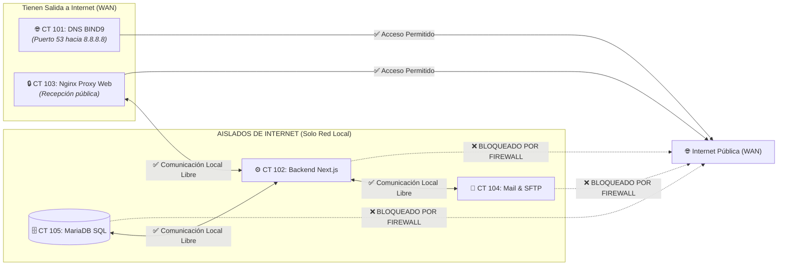

# 🛡️ Guía Práctica: Restricción de Salida a Internet (Egress WAN Filtering)
> **Curso:** Sistemas Operativos I — UMG  
> **Proyecto:** Sistema Integral de Gestión Clínica (Grupo 2)  
> **Nivel:** Principiante / Paso a Paso  
> **Objetivo:** Bloquear la salida a Internet en los servidores internos (Base de Datos, Correo y Backend) para evitar fugas de datos y ataques externos, permitiendo exclusivamente la comunicación en la red local.

---

## 💡 1. ¿Qué es el "Egress Filtering" y por qué lo exige el catedrático?

### La Analogía del Hospital de Máxima Seguridad:
Imagina un hospital real:
* **En recepción (CT 103 - Nginx y CT 101 - DNS):** Hay una ventanilla donde se atiende al público y se consultan directorios.
* **En el sótano (CT 105 - MariaDB y CT 104 - SFTP):** Están los archivos físicos con los expedientes clínicos confidenciales de miles de pacientes.

> [!IMPORTANT]
> **El Principio de Seguridad:** ¿Tiene sentido que la computadora que almacena los diagnósticos médicos confidenciales de los pacientes pueda navegar libremente por YouTube o conectarse a servidores desconocidos en Internet? **No.**
> Si un hacker lograra comprometer un servidor interno, lo primero que intentará hacer es conectarse a Internet para robar los datos (*Data Exfiltration*) o descargar virus (*Command & Control*).
> 
> **La Solución (Egress Filtering):** Cortamos el cable de salida a Internet a los servidores internos. **Solo pueden hablar dentro del hospital (red local `192.168.56.0/24`)**, pero el mundo exterior queda completamente bloqueado.

---

## 🗺️ 2. Mapa de Quién Sale a Internet y Quién NO



---

## ⚡ Opción A: Aplicación Automática (1 solo comando)

Si estás en el Host Proxmox (`ssh root@192.168.56.100`), ejecuta:

```bash
bash /vagrant/23_setup_egress_wan_filtering.sh
```
*(Este script aplica el bloqueo en CT 105, CT 104, CT 102 y en el switch del Host Proxmox automáticamente).*

---

---

## 🛠️ Opción B: Paso a Paso Manual (Comandos Explicados)

La regla universal de seguridad es simple:  
*"Permitir todo lo que vaya a la red local `192.168.56.0/24` y bloquear todo lo demás hacia el exterior".*

> [!TIP]
> **Prerrequisito en Contenedores Minimalistas:**  
> Las plantillas base de Debian 12 LXC son ultra-ligeras y no traen el paquete `iptables` instalado. Si al correr un comando te sale `iptables: command not found`, simplemente instala las herramientas de firewall con:  
> `apt-get update -y && apt-get install -y iptables iptables-persistent`

---

### PASO 1: Bloquear salida WAN en CT 105 (Base de Datos MariaDB)

Conéctate a CT 105:
```bash
ssh root@192.168.56.105
```
*(Contraseña: `proxmox`)*

Instala `iptables` (si no está instalado) y pega estos comandos:
```bash
# 0. Instalar iptables si hace falta
which iptables >/dev/null 2>&1 || (apt-get update -y && apt-get install -y iptables iptables-persistent)

# 1. Permitir tráfico interno del propio contenedor
iptables -A OUTPUT -o lo -j ACCEPT

# 2. Mantener sesiones activas (para no perder la consola SSH)
iptables -A OUTPUT -m conntrack --ctstate ESTABLISHED,RELATED -j ACCEPT

# 3. REGLA CLAVE: Permitir hablar con cualquier máquina de la red local
iptables -A OUTPUT -d 192.168.56.0/24 -j ACCEPT

# 4. REGLA DE BLOQUEO: Bloquear cualquier intento de salir a Internet
iptables -A OUTPUT -j REJECT --reject-with icmp-admin-prohibited

# 5. Guardar permanentemente
netfilter-persistent save 2>/dev/null || true
```

---

### PASO 2: Bloquear salida WAN en CT 104 (Servidor Mail y SFTP)

Conéctate a CT 104:
```bash
ssh root@192.168.56.104
```

Instala `iptables` y pega estos comandos:
```bash
# 0. Instalar iptables si hace falta
which iptables >/dev/null 2>&1 || (apt-get update -y && apt-get install -y iptables iptables-persistent)

# 1. Permitir local y sesiones establecidas
iptables -A OUTPUT -o lo -j ACCEPT
iptables -A OUTPUT -m conntrack --ctstate ESTABLISHED,RELATED -j ACCEPT

# 2. Permitir tráfico hacia la red local (para recibir correos y entregar constancias)
iptables -A OUTPUT -d 192.168.56.0/24 -j ACCEPT

# 3. Bloquear salida a Internet externa
iptables -A OUTPUT -j REJECT --reject-with icmp-admin-prohibited

# 4. Guardar permanentemente
netfilter-persistent save 2>/dev/null || true
```

---

### PASO 3: Bloquear salida WAN en CT 102 (Backend Next.js)

> [!NOTE]
> **No necesitas detener el proyecto:** Next.js y PM2 seguirán funcionando en vivo sin ninguna interrupción. La regla se aplica directamente con el servicio encendido sin afectarlo, ya que la aplicación se comunica únicamente dentro de la red local.

Conéctate a CT 102:
```bash
ssh root@192.168.56.102
```

Instala `iptables` y pega estos comandos:
```bash
# 0. Instalar iptables si hace falta
which iptables >/dev/null 2>&1 || (apt-get update -y && apt-get install -y iptables iptables-persistent)

# 1. Permitir local y sesiones establecidas
iptables -A OUTPUT -o lo -j ACCEPT
iptables -A OUTPUT -m conntrack --ctstate ESTABLISHED,RELATED -j ACCEPT

# 2. Permitir comunicación con MariaDB, Redis, Mail, SFTP y Nginx en la red local
iptables -A OUTPUT -d 192.168.56.0/24 -j ACCEPT

# 3. Bloquear salida a Internet
iptables -A OUTPUT -j REJECT --reject-with icmp-admin-prohibited

# 4. Guardar permanentemente
netfilter-persistent save 2>/dev/null || true
```

---

### PASO 4: Regla perimetral en el Host Proxmox (`192.168.56.100`)

Para reforzar el bloqueo a nivel del switch `vmbr0`:

Conéctate al Host Proxmox:
```bash
ssh root@192.168.56.100
```

Ejecuta:
```bash
# Bloquear en el reenvío hacia la tarjeta de salida eth0 (Internet)
iptables -I FORWARD -s 192.168.56.105 -o eth0 -j REJECT --reject-with icmp-admin-prohibited
iptables -I FORWARD -s 192.168.56.104 -o eth0 -j REJECT --reject-with icmp-admin-prohibited
iptables -I FORWARD -s 192.168.56.102 -o eth0 -j REJECT --reject-with icmp-admin-prohibited
```

---

## 🧪 3. La Prueba de Fuego (Cómo demostrárselo al Catedrático)

Esta demostración dura 1 minuto y deja al profesor impactado por el nivel de seguridad:

### ❌ Prueba 1: Demostrar que CT 105 NO puede salir a Internet
1. Entra a CT 105:
   ```bash
   ssh root@192.168.56.105
   ```
2. Intenta hacer ping al servidor de Google (`8.8.8.8`):
   ```bash
   ping -c 2 8.8.8.8
   ```
   **Resultado esperado:**
   ```text
   ping: connect: Operation not permitted  (o Destination Host Prohibited) ❌
   ```
   *(¡El firewall bloquea el paquete en 0 milisegundos!)*

---

### ✅ Prueba 2: Demostrar que la Red Local sigue 100% OPERATIVA
1. Desde el mismo CT 105, hazle ping al servidor de la aplicación CT 102:
   ```bash
   ping -c 2 192.168.56.102
   ```
   **Resultado esperado:**
   ```text
   2 packets transmitted, 2 received, 0% packet loss, time 1002ms ✅
   ```

---

### 🌐 Prueba 3: Demostrar que la Aplicación Web sigue funcionando intacta
1. Abre tu navegador y entra a `https://clinica.grupo2.os`.
2. Inicia sesión, busca un paciente o emite una constancia.
3. Todo funciona con normalidad porque la aplicación y la base de datos se hablan exclusivamente a través de la red privada local.

---

## 🚨 4. Botón de Emergencia (Deshacer el bloqueo si necesitas instalar algo)

Si en algún momento necesitas descargar un paquete de emergencia con `apt-get` o actualizar Next.js:

* **Para desbloquear CT 105:**
  ```bash
  ssh root@192.168.56.105 "iptables -F OUTPUT"
  ```
* **Para desbloquear CT 104:**
  ```bash
  ssh root@192.168.56.104 "iptables -F OUTPUT"
  ```
* **Para desbloquear CT 102:**
  ```bash
  ssh root@192.168.56.102 "iptables -F OUTPUT"
  ```
*(Esto reactiva el acceso a Internet de inmediato).*

---

## 🗣️ Discurso Técnico para el Catedrático

> *"Ingeniero, como parte de los lineamientos de hardening y auditoría, implementamos una política estricta de control de salida (*Egress Filtering*). Siguiendo el principio de menor exposición, los servidores de base de datos (`CT 105`), almacenamiento SFTP (`CT 104`) y lógica de negocio (`CT 102`) tienen salida a Internet completamente denegada por firewall. Únicamente tienen permitido el tráfico local este-oeste (*East-West traffic*) dentro del segmento `192.168.56.0/24`. Esto garantiza que, incluso ante una vulnerabilidad en la aplicación, ningún actor malicioso pueda exfiltrar datos clínicos hacia redes públicas externas."*
